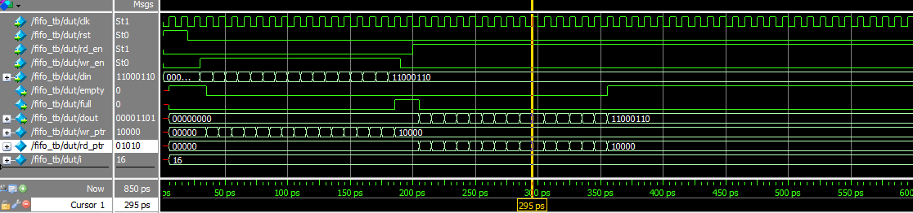

# Synchronous FIFO Verification

## Overview
This project implements and verifies a synchronous FIFO using Verilog.

## Features
- Synchronous read and write operations
- Full flag generation
- Empty flag generation
- Reset functionality

## Verification Scenarios
- Write operation
- Read operation
- Full condition
- Empty condition
- Reset verification

## Tools Used
- Verilog
- ModelSim
## Simulation Waveform

## Author
Muddala Silpa
